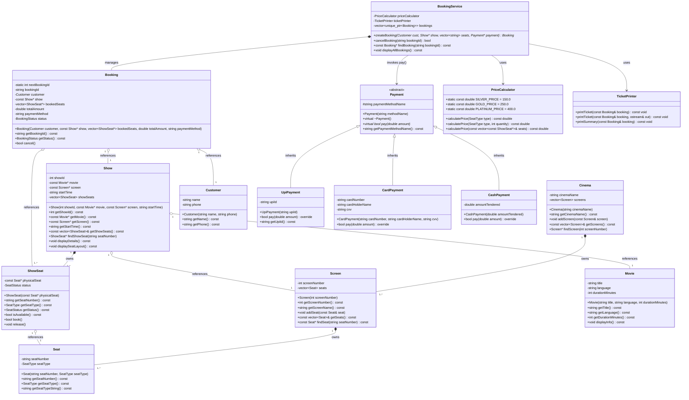
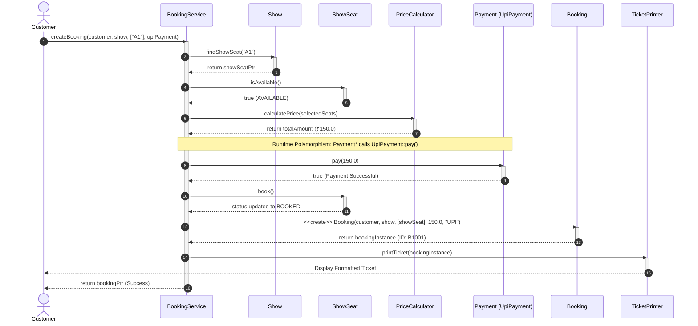

# SYSTEM DESIGN ASSIGNMENT 1 — MOVIE TICKET BOOKING SYSTEM
**Course**: B.Tech CSE — Semester 5 (Object-Oriented Analysis & System Design)  
**Project**: Movie Ticket Booking System for a Single Cinema (Console C++ Application)  
**Author**: Aviral Mittal  
**GitHub Repository**: [https://github.com/aviralmittal7150/System-design](https://github.com/aviralmittal7150/System-design)

---

## 1. REQUIREMENT ANALYSIS

### 1.1 Functional Requirements (FR)

| Requirement ID | Description | Testable Acceptance Criteria |
| :--- | :--- | :--- |
| **FR1: Movie Listing** | The system must list all movies currently scheduled and playing in the cinema. | Outputs movie titles, languages, and durations in a clear formatted list without modifying state. |
| **FR2: Show Selection** | For any selected movie, the system must display its shows with screen number and start time. | Shows filtered by movie title; displays Show ID, Screen name, and start time. |
| **FR3: Seat Layout Display** | For any selected show, the system must render the visual seat layout with tier type and status. | Displays all rows/seats (e.g., A1-A5, B1-B5, C1-C5) with `[AVAILABLE]` or `[BOOKED]` status tags. |
| **FR4: Seat Booking & Validation** | The system must allow booking one or more seats, validating seat existence and availability. | Rejects requests with non-existent seat IDs (e.g. `Z99`) or already-booked seats. Rejection is atomic (no partial locking). |
| **FR5: Dynamic Price Calculation** | Total price must be calculated based on seat tier rates (SILVER = ₹150, GOLD = ₹250, PLATINUM = ₹400). | Calculates the exact cumulative sum for heterogeneous seat selections without hardcoded magic numbers. |
| **FR6: Polymorphic Payment Processing** | Supports UPI, Card, and Cash payments via an abstract payment interface. | Calls derived payment gateway at runtime. If payment fails, seats remain `AVAILABLE` and no booking is confirmed. |
| **FR7: Ticket Generation** | Generates and prints a clean formatted ticket with booking details upon successful payment. | Ticket includes Booking ID (`B1001`), Customer info, Movie, Screen, Show time, Seat numbers + tiers, Total amount, Payment method, and Status. |
| **FR8: Booking Cancellation** | Allows cancelling an existing confirmed booking by Booking ID. | Booking status changes to `CANCELLED`; all associated seats are immediately released back to `AVAILABLE`. |

### 1.2 Non-Functional Requirements (NFR)

1. **NFR1: High Modularity & Separation of Concerns (SoC)**: Domain entities (`Movie`, `Seat`, `Screen`, `Cinema`), business logic (`PriceCalculator`, `BookingService`), and presentation (`CinemaApp`, `TicketPrinter`) are strictly decoupled.
2. **NFR2: Extensibility (Open/Closed Principle)**: New payment channels (e.g. `NetBankingPayment`, `CryptoPayment`) or seat categories can be integrated without modifying `BookingService` or existing classes.
3. **NFR3: Robust Input Validation & Crash Resilience**: All user inputs (integers, strings, non-numeric garbage) are validated with input stream recovery (`std::cin.clear()`, `std::cin.ignore()`). The application never crashes on bad input.
4. **NFR4: ACID-like State Atomicity**: State changes occur only upon payment verification. If payment fails, the transaction is safely rolled back, preventing orphaned seat reservations.

---

## 2. NOUN–VERB ANALYSIS

### 2.1 Analysis Table

| Noun Identified | Kept as Class? | Justification & Architectural Role |
| :--- | :---: | :--- |
| **Movie** | **YES** | Core Entity. Stores title, language, duration metadata. |
| **Seat** | **YES** | Core Entity. Represents physical seat metadata (seat number, tier). |
| **Screen** | **YES** | Core Entity. Represents an auditorium that physically owns a collection of Seats. |
| **Cinema** | **YES** | Core Entity. Represents the theatre building owning multiple Screens. |
| **Show** | **YES** | Core Entity. Connects a Movie, Screen, Start Time, and owns ShowSeats. |
| **ShowSeat** | **YES** | Core Entity. Tracks dynamic seat availability for a specific show. |
| **Customer** | **YES** | Core Entity. Stores customer name and contact phone. |
| **Booking** | **YES** | Transaction Entity. Encapsulates booking ID, customer, show, booked seats, total amount, status. |
| **Payment** | **YES** | Abstract Base Class. Defines pure virtual payment contract `pay(double amount)`. |
| **UpiPayment** | **YES** | Derived Class. Implements UPI payment processing. |
| **CardPayment** | **YES** | Derived Class. Implements Card payment processing. |
| **CashPayment** | **YES** | Derived Class. Implements Cash payment processing. |
| **PriceCalculator** | **YES** | Service Class (SRP). Computes ticket prices based on seat tiers. |
| **TicketPrinter** | **YES** | Service Class (SRP). Formats and renders tickets. |
| **BookingService** | **YES** | Orchestration Service. Coordinates the end-to-end booking workflow. |
| *CinemaApp* | **YES** | Presentation / UI Class. Manages console menus and user interaction. |
| *Seat Layout* | **NO** | Rejected. Seat layout is a transient view rendered from a `Show`'s `ShowSeat` collection, not an entity. |
| *Start Time* | **NO** | Rejected. Represented as an attribute (`std::string`) within the `Show` entity. |
| *Language / Duration* | **NO** | Rejected. Primitive attributes belonging to the `Movie` class. |
| *Seat Type / Status* | **NO** (Enum) | Implemented as type-safe `enum class SeatType` and `enum class SeatStatus`. |
| *Ticket* | **NO** | Formatted output rendered by `TicketPrinter` using a `Booking` instance. |

---

## 3. RELATIONSHIP TABLE & LIFETIME TEST JUSTIFICATIONS

The relationship between classes is established using the **Lifetime Test**:  
*"If the parent/container object is destroyed, does the contained/referenced object also cease to exist?"*

| S.No | Relationship Pair | UML Relationship | Lifetime Test Reasoning & Justification |
| :---: | :--- | :---: | :--- |
| **1** | **Cinema — Screen** | **Composition** (`◆──`) | **Lifetime Tied**: A Screen physically exists inside a Cinema auditorium. If the Cinema building is destroyed, all its Screens are destroyed with it. |
| **2** | **Screen — Seat** | **Composition** (`◆──`) | **Lifetime Tied**: Physical seats are fixed inside an auditorium. If the Screen is demolished/destroyed, its physical seats cease to exist. |
| **3** | **Show — Movie** | **Aggregation** (`◇──`) | **Independent Lifetime**: A Show screens a Movie. If the Show is cancelled or ends, the Movie still exists in the cinema catalogue. |
| **4** | **Show — Screen** | **Aggregation** (`◇──`) | **Independent Lifetime**: A Show occurs in a Screen. When the show finishes, the Screen remains intact for subsequent screenings. |
| **5** | **Show — ShowSeat** | **Composition** (`◆──`) | **Lifetime Tied**: A `ShowSeat` represents availability for *that specific screening*. When the Show screening is removed, its `ShowSeat` statuses are destroyed. |
| **6** | **Booking — Customer** | **Aggregation** (`◇──`) | **Independent Lifetime**: A Customer creates a Booking. If the Booking is cancelled or deleted, the Customer entity continues to exist independently. |
| **7** | **Booking — ShowSeat** | **Aggregation** (`◇──`) | **Independent Lifetime**: A Booking references reserved `ShowSeat`s. If the booking is cancelled, the `ShowSeat` objects still exist in the `Show` and are marked available. |
| **8** | **Booking — Payment** | **Association** (`──▶`) | **Independent Lifetime**: Booking records the payment method name and delegates execution. It does not own the payment gateway lifeline. |
| **9** | **Payment — UpiPayment** | **Inheritance** (`──▷`) | **Is-A Relationship**: `UpiPayment` is-a specialized `Payment` that overrides `virtual bool pay(double amount)`. |
| **10** | **BookingService — Booking** | **Aggregation / Composition** (`◇──`) | **Service Management**: `BookingService` manages the lifecycle of confirmed `Booking` instances in memory and coordinates seat workflows. |

---

## 4. UML CLASS DIAGRAM



---

## 5. UML SEQUENCE DIAGRAM

### Scenario: Customer books ONE seat and pays by UPI



---

## 6. SOLID PRINCIPLES MAPPING

| Principle | Implementation in Codebase | Architectural Justification |
| :--- | :--- | :--- |
| **S — Single Responsibility Principle (SRP)** | - `Booking`: Stores reservation data only.<br>- `PriceCalculator`: Exclusively computes ticket amounts.<br>- `TicketPrinter`: Exclusively renders ticket layouts.<br>- `Payment`: Declares payment contract.<br>- `BookingService`: Coordinates workflow. | Combining pricing, ticket printing, and payment inside `Booking` would cause high coupling; changes in ticket format would force re-testing financial logic. |
| **O — Open / Closed Principle (OCP)** | Adding new payment methods (e.g., `NetBankingPayment`, `CryptoPayment`) is accomplished by creating new classes extending `Payment`. | `BookingService` and `CinemaApp` do not require code changes when new payment gateways are introduced. Open for extension, closed for modification. |
| **L — Liskov Substitution Principle (LSP)** | `UpiPayment`, `CardPayment`, and `CashPayment` all adhere strictly to `Payment::pay(double)`. | Any `Payment*` pointer in `BookingService::createBooking(...)` can be substituted with any derived subtype without breaking correctness. |
| **I — Interface Segregation Principle (ISP)** | The `Payment` interface exposes only `pay(double)`. It does NOT force unrelated methods like `refund()`, `validateLoyaltyPoints()`, or `generateOtp()`. | Not all payment channels support automatic refunds (e.g. Cash); forcing unused methods would violate ISP. |
| **D — Dependency Inversion Principle (DIP)** | `BookingService` depends on the high-level abstract interface `Payment*`, not concrete derived classes (`UpiPayment`, `CardPayment`). | `BookingService` is decoupled from low-level payment mechanics; payment instances are injected at runtime. |

### Deliberately Omitted Feature
> **Deliberately Not Implemented**: *External SQL / NoSQL Database Persistence and Online Multi-theatre Network Synchronization*.  
> **Reasoning**: The assignment explicitly scopes a self-contained, single-cinema, menu-driven console application. Adding external database dependencies (e.g., SQLite, PostgreSQL) would introduce unnecessary external runtime dependencies and overhead without adding educational value to the core OOP and System Design evaluation criteria. In-memory data structures with RAII and modern C++ pointers fully satisfy all transaction lifecycle requirements.

---

## 7. OOP CONCEPTS DEMONSTRATION & CODE MAPPING

| OOP Concept | Where & How Implemented in Code | Key Code Reference |
| :--- | :--- | :--- |
| **Encapsulation** | Member variables are `private`. State mutations occur strictly via controlled methods (e.g. `ShowSeat::book()`, `Booking::cancel()`). | `ShowSeat.h:16-30`, `Booking.h:20-40` |
| **Abstraction** | Abstract base class `Payment` defines pure virtual method `virtual bool pay(double) = 0;`. | `Payment.h:17` |
| **Inheritance** | `UpiPayment`, `CardPayment`, `CashPayment` inherit publicly from `Payment`. | `UpiPayment.h:10`, `CardPayment.h:10` |
| **Runtime Polymorphism** | Base `Payment*` invokes overridden `pay()` at runtime based on the dynamic object type. | `BookingService.cpp:38`, `BookingService.h:29` |
| **Compile-Time Polymorphism** | Function overloading in `PriceCalculator::calculatePrice` (by seat type, by quantity, by seat list) and `TicketPrinter::printTicket`. | `PriceCalculator.h:20-28`, `TicketPrinter.h:16-22` |
| **Static Members** | `static int nextBookingId` in `Booking` generates consecutive IDs (e.g. `B1001`, `B1002`). | `Booking.h:21`, `Booking.cpp:4` |
| **`this` Keyword** | Used across all entity constructors and methods to disambiguate parameters from member fields. | `Movie.cpp:5-8`, `Seat.cpp:5-8`, `Show.cpp:6-9` |
| **Composition** | `Cinema ◆── Screen`, `Screen ◆── Seat`, `Show ◆── ShowSeat`. Child lifetime is bound to parent. | `Cinema.h:18`, `Screen.h:18`, `Show.h:23` |
| **Aggregation** | `Show ◇── Movie`, `Show ◇── Screen`, `Booking ◇── ShowSeat`. Referenced objects exist independently. | `Show.h:20-21`, `Booking.h:24-25` |
| **Association** | `Customer ──▶ BookingService`. Customer uses booking service without ownership coupling. | `CinemaApp.cpp:180-210` |

---

## 8. EDGE CASE HANDLING & VERIFICATION MATRIX

| Test Scenario | Input / Action | Expected Result | Verified Result |
| :--- | :--- | :--- | :---: |
| **Case 1: Already-Booked Seat** | Attempt booking seat `A1` after it is already booked. | Error: `"Seat A1 is already booked"`. Request rejected; no state change. | **PASSED** |
| **Case 2: Payment Failure Rollback** | Select seat `B1`, payment fails (`fail@upi` / insufficient cash). | Error: `"Payment failed. Booking NOT confirmed"`. Seat `B1` remains `AVAILABLE`. | **PASSED** |
| **Case 3: Booking Cancellation** | Cancel booking `B1001` via option 6. | Booking marked `CANCELLED`; seat `A1` returned to `AVAILABLE` for new bookings. | **PASSED** |
| **Case 4: Invalid Seat Number** | Enter non-existent seat `Z99`. | Error: `"Invalid seat number: Z99"`. Program handles gracefully without crash. | **PASSED** |
| **Case 5: Invalid Menu Input** | Enter invalid integer `99` or non-numeric characters (`abc`). | Error: `"Invalid choice"`. Input buffer cleared; menu re-prompted. | **PASSED** |
| **Case 6: Multi-tier Price Calculation** | Book `B1` (GOLD: ₹250) + `C1` (PLATINUM: ₹400). | Total calculated = `₹650.00`. | **PASSED** |

---

## 9. SAMPLE TICKET OUTPUT

```
========================================
TICKET
======

Booking ID : B1001
Customer   : Aviral Mittal (9876543210)
Movie      : Interstellar
Screen     : Screen 1
Time       : 07:30 PM

Seats:
A1 - SILVER
B3 - GOLD

Total Amount : ₹400.00

Payment      : UPI
Status       : CONFIRMED

========================================
```

---

## 10. BUILD & RUN INSTRUCTIONS

### Prerequisites
- C++17 compliant compiler (`g++` or `clang++`)
- `make` utility

### Compilation
```bash
# Build the main application
make

# Run the interactive console application
./movie_booking_system

# Run the automated verification test suite
make test

# Clean build artifacts
make clean
```
