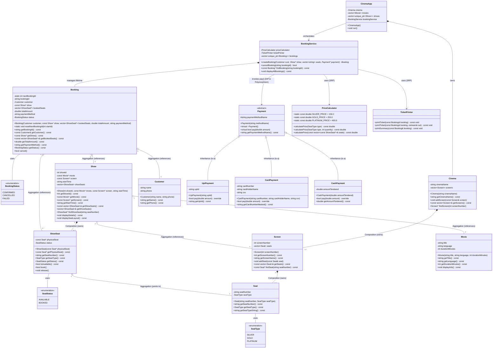
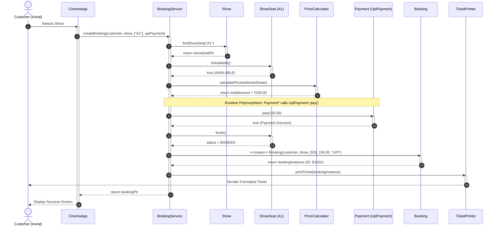
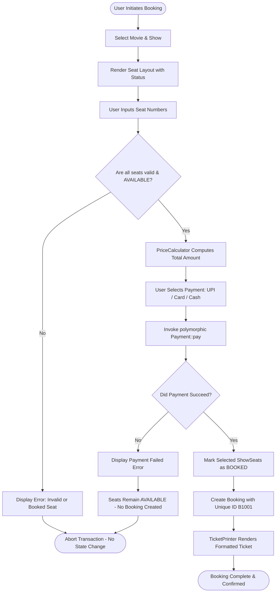
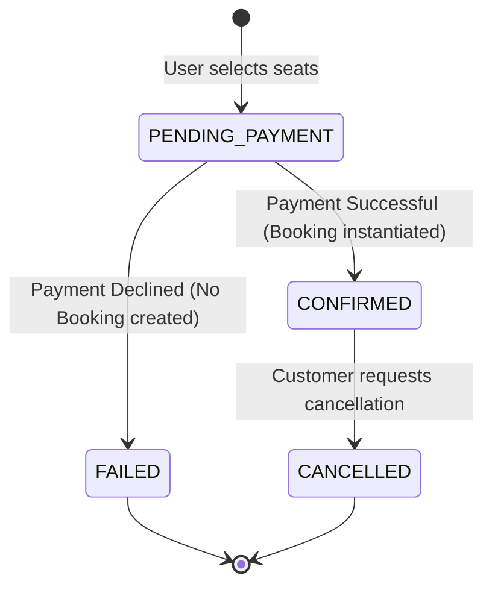

# SYSTEM DESIGN & UML DIAGRAMS
**Movie Ticket Booking System for a Single Cinema**  
**Course**: B.Tech CSE Semester 5 | System Design & OOP  
**Author**: Aviral Mittal  
**Repository**: [aviralmittal7150/System-design](https://github.com/aviralmittal7150/System-design)

---

## 1. COMPREHENSIVE UML CLASS DIAGRAM



---

## 2. UML SEQUENCE DIAGRAM
### Scenario: "Customer books ONE seat and pays by UPI"



---

## 3. ACTIVITY / WORKFLOW DIAGRAM (BOOKING WORKFLOW)



---

## 4. STATE MACHINE DIAGRAMS

### 4.1 ShowSeat Lifecycle State Machine

```mermaid
stateDiagram-v2
    [*] --> AVAILABLE : Show Created / Initialized
    
    AVAILABLE --> BOOKED : Payment Succeeded (ShowSeat::book())
    AVAILABLE --> AVAILABLE : Payment Failed (Rollback / No Change)
    
    BOOKED --> AVAILABLE : Booking Cancelled (ShowSeat::release())
    BOOKED --> [*] : Show Screening Concluded
```

### 4.2 Booking Lifecycle State Machine



---

## 5. SYSTEM ARCHITECTURE & PACKAGE DIAGRAM

```mermaid
flowchart TB
    subgraph Presentation_Layer [Presentation Layer]
        CinemaApp[CinemaApp / Console Menu]
    end

    subgraph Service_Layer [Service & Business Logic Layer]
        BookingService[BookingService Orchestrator]
        PriceCalculator[PriceCalculator (SRP)]
        TicketPrinter[TicketPrinter (SRP)]
    end

    subgraph Payment_Layer [Payment Abstraction Layer (DIP / OCP / LSP)]
        Payment["«abstract» Payment"]
        UpiPayment[UpiPayment]
        CardPayment[CardPayment]
        CashPayment[CashPayment]
    end

    subgraph Domain_Layer [Domain Entities Layer (Composition / Aggregation)]
        Cinema[Cinema]
        Screen[Screen]
        Seat[Seat]
        Show[Show]
        ShowSeat[ShowSeat]
        Movie[Movie]
        Customer[Customer]
        Booking[Booking]
    end

    Presentation_Layer --> Service_Layer
    Presentation_Layer --> Domain_Layer
    Service_Layer --> Payment_Layer
    Service_Layer --> Domain_Layer
    Payment_Layer <|-- UpiPayment
    Payment_Layer <|-- CardPayment
    Payment_Layer <|-- CashPayment
```
